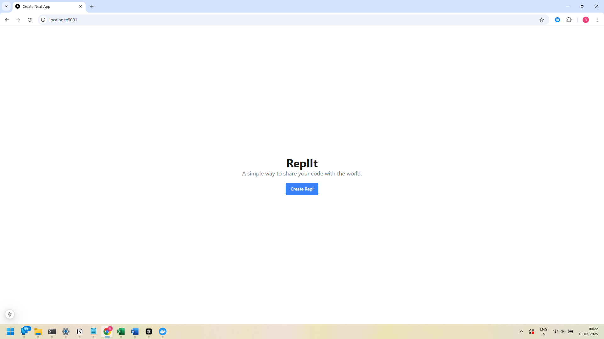
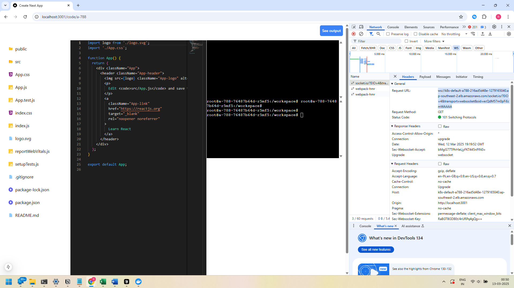
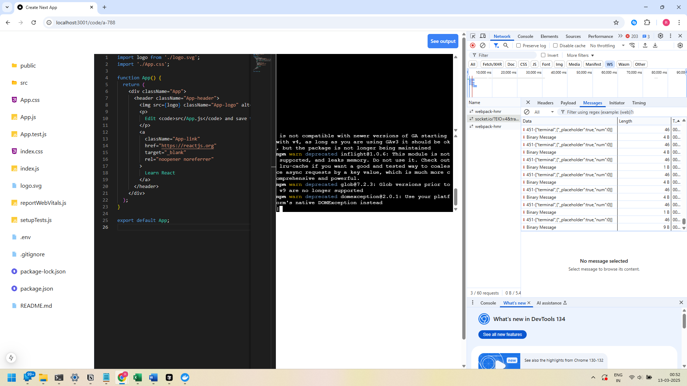
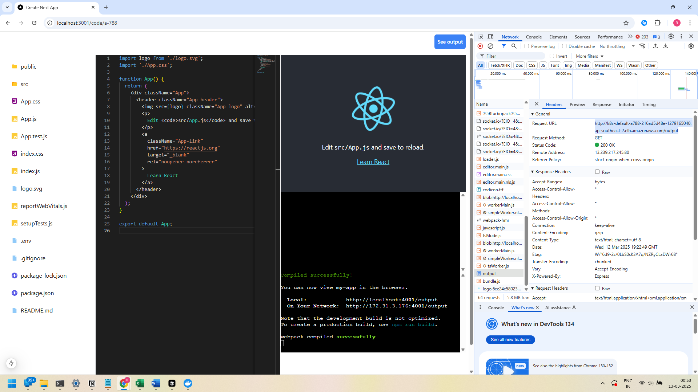

# Replit Clone - Online coding platform (In Progress)

This online coding platform allows users to that allows you to write, and run code directly from your browser.

## Tech Stack

- <b>Frontend/Backend:</b> Next.js 15, Express
- <b>Orchestration & Deployment:</b> Kubernetes, AWS EKS
- <b>Real-Time Communication:</b> WebSockets
- <b>Storage:</b> AWS S3
- <b>UI Framework:</b> Tailwind CSS

## Features

- <b>Cloud-Based:</b> No setup required; code from anywhere.
- <b>CLI:</b> User has complete access to the terminal session.
- <b>Browser window:</b> User has their own browser window for seeing outputs.

## Architecture

- ### 2 services
    <b>Web:</b>
    
    - Application allows users to create a React Repl (Online coding environment)
    - Copies base react files from S3 to a new location in S3 unique to the repl
    - Executes kubernetes deployment to setup a new coding environment (Pod, Service, Ingress)
    
    <b>Runner:</b>
    - Socket server runs in a pod in the kubernetes cluster when user requests for a repl
    - Socket server has methods for directory access and file access
    - Exposes extra port for code output display in the browser

## Project

1. Landing page with create repl button to create a react development environment

2. Online coding page in browser with files, and folders access

3. User having full access to the terminal. Running "npm i" command in the terminal

4. Can see the developed web application output in the browser on "Show output" button click
